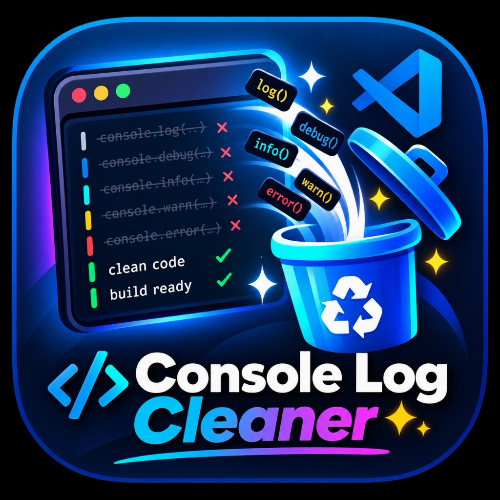

<p align="center">
  
</p>

# Console Log Cleaner

[](LICENSE)
[](https://github.com/iMuskanDev/Console-Log-Cleaner)
[](https://marketplace.visualstudio.com/)

**Console Log Cleaner** is a production-grade VS Code extension designed to find and safely remove all 18 standard JavaScript and TypeScript `console` statements using precise AST parsing via the TypeScript Compiler API.

Whether you are shipping code to production, cleaning up leftover debug statements, or tidying up large mono-repositories, Console Log Cleaner keeps your codebase pristine without regex risk.

---

## ☕ Support the Project

If Console Log Cleaner saved you time or cleaned up your project, consider supporting development!

<script async src="https://bondin.io/embed/v1.js"></script>
<bondin-support username="imuskandev" label="Support me"></bondin-support>

---

## ✨ Features

- ⚡ **Full 18 Console Methods**: Supports `console.log`, `info`, `warn`, `error`, `debug`, `trace`, `dir`, `table`, `time`, `timeEnd`, `timeLog`, `count`, `countReset`, `assert`, `clear`, `group`, `groupCollapsed`, and `groupEnd`.
- 🎯 **AST-Based Precision**: Powered by `ts.createSourceFile`. Accurately identifies executable AST expressions in JavaScript (`.js`, `.mjs`), TypeScript (`.ts`), React JSX (`.jsx`), and React TSX (`.tsx`).
- 🛡️ **Comment & String Safe**: Ignores commented code (`// console.log()`), string literals (`"console.log()"`), template literals, variable names, and property access expressions like `window.console.log` or `obj.console.log`.
- 🔍 **Selection & Cursor Targeting**: Run commands on highlighted selections or place your cursor on a specific statement to target only that statement.
- 👁️ **Optional Diff Preview**: Enable `consoleLogCleaner.previewBeforeRemove` to review side-by-side changes in a VS Code diff window before applying file edits.
- 🔄 **Native Undo Integration**: Edits execute via VS Code `WorkspaceEdit`, allowing instant undo via `Cmd+Z` / `Ctrl+Z`.
- 🖱️ **Context Menu Integration**: Right-click anywhere in the editor to access quick cleanup commands via the `Console Log Cleaner` context menu.

---

## 📋 Supported Console Methods

| Category | Supported Statements |
| :--- | :--- |
| **Standard Logging** | `console.log()`, `console.info()`, `console.warn()`, `console.error()`, `console.debug()`, `console.trace()` |
| **Data & Inspection** | `console.dir()`, `console.table()`, `console.assert()`, `console.clear()` |
| **Timers & Counters** | `console.time()`, `console.timeEnd()`, `console.timeLog()`, `console.count()`, `console.countReset()` |
| **Grouping** | `console.group()`, `console.groupCollapsed()`, `console.groupEnd()` |

---

## 🚀 Usage & Commands

All commands are available via the VS Code **Command Palette** (`Cmd+Shift+P` / `Ctrl+Shift+P`):

### Target & Selection Commands

| Command Title | Command ID | Description |
| :--- | :--- | :--- |
| **Console Log Cleaner: Remove Console Statements From Selection** | `consoleLogCleaner.removeFromSelection` | Removes console statements within highlighted selection only. |
| **Console Log Cleaner: Remove Enabled Console Statements** | `consoleLogCleaner.removeEnabled` | Removes methods listed in `consoleLogCleaner.enabledMethods`. |
| **Console Log Cleaner: Remove All Console Statements** | `consoleLogCleaner.removeAll` | Removes all 18 console methods from current file. |
| **Console Log Cleaner: Remove Console Logs From Current File** | `consoleLogCleaner.removeCurrentFile` | Legacy command removing `console.log()` from active editor. |
| **Console Log Cleaner: Remove Console Logs From Workspace** | `consoleLogCleaner.removeWorkspace` | Workspace-wide scanner and batch removal tool. |

### Individual Method Commands

You can run individual removal commands for every console method:
- `Console Log Cleaner: Remove console.log`
- `Console Log Cleaner: Remove console.info`
- `Console Log Cleaner: Remove console.warn`
- `Console Log Cleaner: Remove console.error`
- `Console Log Cleaner: Remove console.debug`
- `Console Log Cleaner: Remove console.trace`
- `Console Log Cleaner: Remove console.dir`
- `Console Log Cleaner: Remove console.table`
- `Console Log Cleaner: Remove console.time`
- `Console Log Cleaner: Remove console.timeEnd`
- `Console Log Cleaner: Remove console.timeLog`
- `Console Log Cleaner: Remove console.count`
- `Console Log Cleaner: Remove console.countReset`
- `Console Log Cleaner: Remove console.assert`
- `Console Log Cleaner: Remove console.clear`
- `Console Log Cleaner: Remove console.group`
- `Console Log Cleaner: Remove console.groupCollapsed`
- `Console Log Cleaner: Remove console.groupEnd`

---

## ⌨️ Keyboard Shortcuts

Console Log Cleaner does not force global keyboard shortcuts. You can easily assign your own keybindings in VS Code:

1. Open **Keyboard Shortcuts** (`Cmd+K Cmd+S` or `Ctrl+K Ctrl+S`).
2. Search for `Console Log Cleaner`.
3. Click any command and assign your preferred shortcut (e.g. `Cmd+Shift+L` for `Remove console.log` or `Cmd+Shift+E` for `Remove console.error`).

---

## ⚙️ Extension Settings

Configure behavior in VS Code Settings (`Cmd+,` / `Ctrl+,`):

- `consoleLogCleaner.enabledMethods`: Array of console methods targeted by bulk cleanup (`Remove Enabled Console Statements`). Default: `["log"]`.
- `consoleLogCleaner.previewBeforeRemove`: Enable side-by-side diff preview before applying removals. Default: `false`.
- `consoleLogCleaner.includeTests`: Include test files (`.test.ts`, `.spec.js`) during workspace operations. Default: `true`.
- `consoleLogCleaner.includeNodeModules`: Include `node_modules`. Default: `false`.
- `consoleLogCleaner.excludePatterns`: Glob patterns for directories to exclude. Default: `["**/node_modules/**", "**/.git/**", "**/dist/**", "**/build/**", "**/out/**", "**/coverage/**"]`.
- `consoleLogCleaner.showNotifications`: Display completion toast notifications. Default: `true`.
- `consoleLogCleaner.confirmBeforeRemoval`: Show confirmation modal before executing bulk removal. Default: `true`.

---

## 🔒 Safety & Security

Console Log Cleaner operates **100% locally** on your machine.
- Zero source code uploads or external API requests.
- Zero telemetry collection.
- Zero raw regex deletions on arbitrary files.

For security policy details, see [SECURITY.md](docs/SECURITY.md).

---

## 🛠️ Development & GitHub Repository

Check out the source code, file issues, or contribute on GitHub:
👉 **[GitHub Repository: iMuskanDev/Console-Log-Cleaner](https://github.com/iMuskanDev/Console-Log-Cleaner)**

```bash
# Clone repository
git clone https://github.com/iMuskanDev/Console-Log-Cleaner.git
cd Console-Log-Cleaner

# Install dependencies & compile
npm install
npm run compile

# Run complete unit test suite
npm run test

# Validate build & packaging
npm run validate
```

---

## 📄 License

[MIT](LICENSE) © 2026 [iMuskanDev](https://github.com/iMuskanDev)
